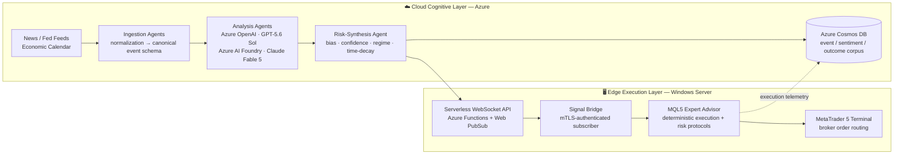

# XAU Dynamics

**Agentic AI infrastructure for macroeconomic sentiment intelligence and systematic XAU/USD execution.**

Event-driven multi-agent pipeline on Azure · Serverless WebSocket signal distribution · Deterministic MQL5 edge execution

---

## 🎯 Executive Summary

**XAU/USD** is uniquely exposed to exogenous macro shocks — central bank policy shifts, **CPI/NFP releases**, and geopolitical risk events — that drive intraday volatility expansions of **3–5× baseline ATR**. Conventional MQL5 Expert Advisors consume only price-derived, lagging indicators and are therefore structurally blind to event risk: they encode a regime change only *after* the move has occurred.

**XAU Dynamics** closes this gap with a hybrid **cloud-edge architecture**. A multi-agent AI pipeline on Azure transforms unstructured macroeconomic information — news wires, Federal Reserve communications, economic releases — into a **quantified sentiment state vector**. Locally hosted MQL5 executors consume that vector as a *policy input* — directional bias, sizing constraints, event lockouts — while retaining full deterministic control of order execution at the terminal.

> **Cognition in the cloud. Execution at the edge. No LLM in the order path.**

---

## 🏗️ Core Architecture & Microservices Flow

The system enforces strict separation between the **cognitive layer** (probabilistic, seconds-scale, Azure-hosted) and the **execution layer** (deterministic, milliseconds-scale, locally hosted). This separation is the central design invariant: **cloud latency and model non-determinism are architecturally excluded from the order path.**

### 1. ⚡ Ingestion Agents — Event-Driven

Triggered by event streams rather than polling — **compute is consumed only when information arrives**. Unstructured sources (financial news wires, FOMC statements and minutes, macroeconomic release data) are normalized into a canonical, timestamped event schema before analysis.

### 2. 🧠 Analysis Agents — Ensemble LLM Inference

Specialized agents perform:

- **Entity-grounded sentiment extraction**
- **Hawkish/dovish classification** of central bank language
- **Surprise-vs-consensus scoring** of economic releases

Inference runs across **heterogeneous frontier models** — **GPT-5.6 Sol** via Azure OpenAI and **Claude Fable 5** via Azure AI Foundry — under a single governance and billing perimeter.

### 3. ⚙️ Risk-Synthesis Agent — Signal Aggregation

Agent outputs are aggregated into a single quantified state vector:

| Field | Description |
| :--- | :--- |
| `bias` | Directional bias ∈ [-1, +1] |
| `confidence` | Ensemble-agreement-weighted confidence interval |
| `regime` | Volatility regime classification |
| `ttl` | Time-decay function governing signal validity |
| `lockout` | Hard event-window trading suspension flag |

> **Ensemble disagreement scoring:** when independent model families diverge, confidence is penalized mathematically rather than resolved arbitrarily. Under uncertainty the system **reduces position risk** — it does not manufacture signal frequency.

### 4. 📡 Signal Distribution — Serverless WebSocket

The state vector is fanned out to subscribed execution hosts over a persistent, mutually authenticated WebSocket channel (**Azure Functions + Web PubSub**). The serverless backbone aligns the cost curve with actual information flow.

### 5. 🎯 MQL5 Edge Execution — Deterministic

Executors on hardened **Windows Server** instances own all microstructure-level logic:

- Entry and exit
- Stop management
- Position sizing
- Risk protocols

**Zero cloud round-trips in the execution path.** The cloud modulates policy; the edge owns execution.

> **Fail-safe degradation:** on loss of cloud connectivity or signal-TTL expiry, executors revert to a defensive flat-bias posture. The system's failure mode is *reduced exposure*, never unguarded execution.

---

## 🧰 Technology Stack

| Layer | Technology | Role |
| :--- | :--- | :--- |
| **LLM Inference** | Azure OpenAI — GPT-5.6 Sol | Sentiment extraction, policy-language classification |
| **LLM Inference** | Azure AI Foundry — Claude Fable 5 | Independent ensemble leg for disagreement scoring |
| **Orchestration** | Event-driven multi-agent pipeline | Ingestion → analysis → risk synthesis |
| **Messaging** | Azure Functions + Web PubSub (WebSocket) | Low-latency signal fan-out to execution hosts |
| **Persistence** | Azure Cosmos DB | Event/sentiment/outcome corpus; execution telemetry; audit trail |
| **Execution** | MQL5 Expert Advisor / MetaTrader 5 | Deterministic order management and risk protocols |
| **Execution Hosts** | Windows Server (Azure VMs) | Hardened, low-latency MT5 terminal hosting |
| **Security** | Azure Zero Trust (Entra ID, Key Vault, Private Endpoints) | Identity, secrets, and network isolation |

---

## 🛡️ Enterprise-Grade Standards & Security

In a financial-automation context, **the signal channel is the attack surface**. The platform inherits its security posture from the Azure **Zero Trust** model rather than bespoke implementations:

- **Identity-first access** — managed identities via **Microsoft Entra ID**; no static credentials in code or configuration.
- **Secrets management** — all keys, connection strings, and broker credentials held in **Azure Key Vault**.
- **Network isolation** — private endpoints for Cosmos DB and inference services; per-terminal **mutual TLS** authentication on the WebSocket channel.
- **Full auditability** — every signal emission and every execution decision is persisted to Cosmos DB with timestamps, enabling deterministic replay and compliance review.

### 🤖 Responsible AI

- LLM outputs are **advisory policy inputs, never direct order instructions** — a hard architectural boundary, not a convention.
- Ensemble disagreement penalizes confidence under model uncertainty.
- Hard event lockouts and TTL expiry bound the blast radius of any erroneous signal.
- Fail-safe defaults: connectivity loss degrades to flat-bias, not to stale-signal execution.

---

## 💼 Business Model — B2B SaaS / IaaS

XAU Dynamics is an **infrastructure provider, not a retail trading bot**. Target segments: proprietary trading firms, quantitative hedge funds, and institutional trading desks.

| Offering | Model | Description |
| :--- | :--- | :--- |
| **Sentiment Signal API** | B2B SaaS (tiered subscription) | Direct API/WebSocket access to the quantified sentiment state vector for integration into existing execution stacks |
| **Managed Execution Infrastructure** | IaaS | Pre-integrated, hardened Windows Server execution environments with the signal bridge pre-installed |
| **Platform Licensing** | Enterprise | Multi-agent orchestration and ensemble-scoring framework deployed on the client's own Azure tenant |

The compounding asset is the **event/sentiment/outcome corpus**: a structured, timestamped dataset pairing macroeconomic events, model-assessed sentiment, and realized market outcomes — proprietary evaluation and refinement data that cannot be reconstructed retroactively.

---

*Built for the future of quantitative finance.* 🌐

